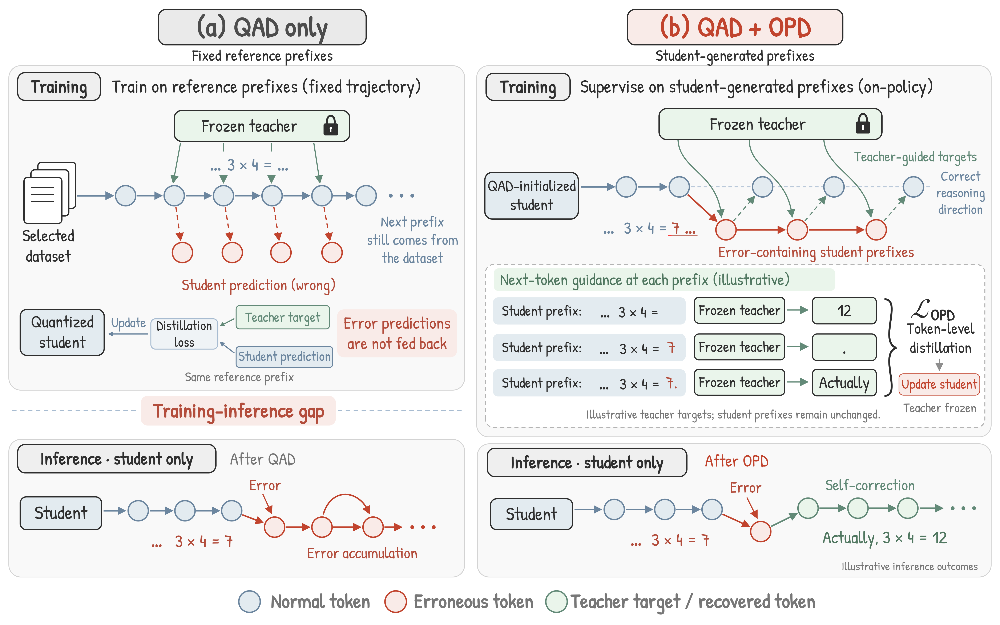
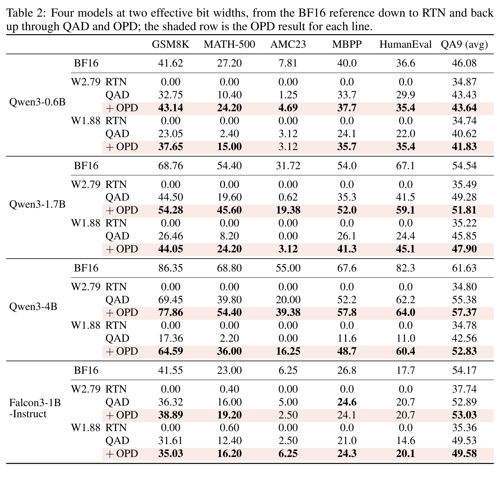
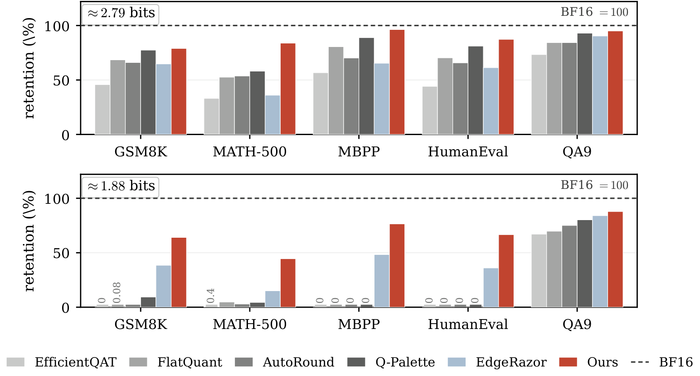
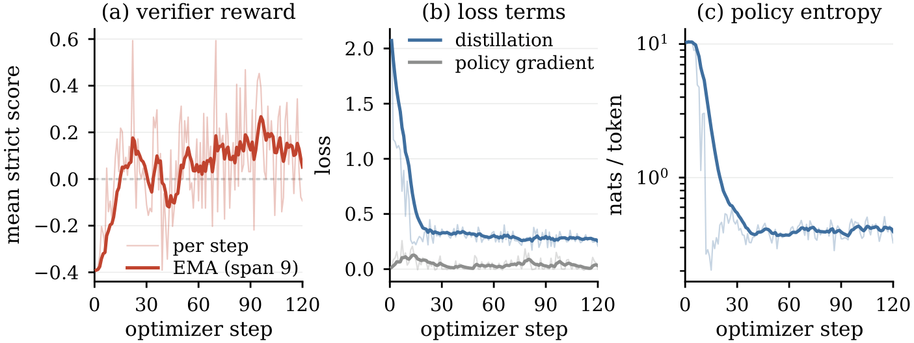

<div align="center">

# QAOPD

**On-Policy Distillation for Low-Bit Reasoning**

Recovering reasoning in sub-3-bit Qwen3 after quantization-aware distillation

[](LICENSE)
[](https://huggingface.co/collections/MingZwhy/qaopd-6ab017003084702d3e45610b)
[](https://arxiv.org/abs/2609.26708)

</div>

---

Quantization-aware distillation (QAD) restores most short-form ability after
sub-3-bit weight quantization, but leaves long-form reasoning badly degraded:
generations fail to terminate and collapse into repetition. On-policy
distillation (OPD) starts from the QAD checkpoint and moves teacher supervision
onto the prefixes the quantized student actually produces — which is exactly
where those failures happen.

<div align="center">

</div>

**(a)** QAD supervises on reference prefixes, so the student never sees its own
errors and they accumulate at inference. **(b)** OPD supervises on
student-generated prefixes, so the teacher's next-token target is available at
the states where the student actually goes wrong.

---

## Results

Two effective widths, W2.79 (50% INT4 / 50% INT1.58) and W1.88 (12.5% /
87.5%). Every row is the same evaluation harness; `+ OPD` is this work.

<div align="center">

</div>

RTN is round-to-nearest at the same width: every generative benchmark is zero,
which is why QAD comes first. The gap OPD closes is largest exactly where QAD
left the most behind — Qwen3-4B at W1.88 goes from 17.36 to 64.59 on GSM8K.
Falcon3-1B-Instruct is in the paper as cross-architecture evidence; this
repository covers the six Qwen3 arms.

### Against other quantization methods

<div align="center">

</div>

Qwen3-1.7B against post-training quantization and quantization-aware training
at the same widths. Likelihood-scored QA survives quantization far better than
anything generative, so a method can look healthy on QA9 and still produce
nothing usable on GSM8K.

---

## Three ways to use this repository

Install first; after that pick whichever row answers your question.

| | | Time |
|---|---|---:|
| **1** | [Install](#1--install) — two environments, patched dependencies | ~1 h |
| **2** | [Evaluate the released weights](#2--evaluate-the-released-weights) — reproduce the table above from the Hub | ~2 h |
| **3a** | [Train the whole chain](#3a--the-whole-chain-from-bf16) — BF16 → QAD → OPD | days |
| **3b** | [Reproduce OPD phase 1](#3b--reproduce-opd-phase-1-from-our-qad-checkpoint) — from our QAD checkpoint; the step this paper is about | ~4 h |
| **3c** | [Add the code stage](#3c--add-the-code-stage) — MBPP, held-out test rows | hours |

You can run 3b to reproduce the paper's core result relatively quickly: it
trains the step the method is about, starting from a checkpoint you download
rather than one you spend a week producing.

### 1 · Install

```bash
git clone https://github.com/MingZwhy/QAOPD.git
cd QAOPD
bash setup/bootstrap.sh          # submodules, third-party patches, venvs
```

`bootstrap.sh` checks out two submodules and builds two environments.
[verl](https://github.com/volcengine/verl) runs the on-policy loop — vLLM
rollout, FSDP training, Ray orchestration — and
[EdgeRazor](https://github.com/zhangsq-nju/EdgeRazor) supplies the
mixed-precision quantizer used both for QAD and inside the OPD forward path.
Our changes to each are patches under `third_party/patches/`. The two
environments are separate because the training stack pins vLLM and the
evaluation stack pins lm-eval, and their dependencies do not co-install.

Do not clone with `--recursive`; `bootstrap.sh` fetches the submodules itself.
Details and the reason are in [docs/INSTALL.md](docs/INSTALL.md).

### 2 · Evaluate the released weights

Every arm ships two checkpoints: the recovered one, with quantization baked
in, which you download and score; and the QAD one, which is the training start
point 3b uses. Both are in the
[QAOPD collection](https://huggingface.co/collections/MingZwhy/qaopd-6ab017003084702d3e45610b).

| Arm | Recovered — load and evaluate | QAD start — train from |
|---|---|---|
| Qwen3-0.6B W2.79 | [`…-0.6B-W2.79-QAOPD`](https://huggingface.co/MingZwhy/Qwen3-0.6B-W2.79-QAOPD) | [`…-0.6B-W2.79-QAD`](https://huggingface.co/MingZwhy/Qwen3-0.6B-W2.79-QAD) |
| Qwen3-0.6B W1.88 | [`…-0.6B-W1.88-QAOPD`](https://huggingface.co/MingZwhy/Qwen3-0.6B-W1.88-QAOPD) | [`…-0.6B-W1.88-QAD`](https://huggingface.co/MingZwhy/Qwen3-0.6B-W1.88-QAD) |
| Qwen3-1.7B W2.79 | [`…-1.7B-W2.79-QAOPD`](https://huggingface.co/MingZwhy/Qwen3-1.7B-W2.79-QAOPD) | [`…-1.7B-W2.79-QAD`](https://huggingface.co/MingZwhy/Qwen3-1.7B-W2.79-QAD) |
| Qwen3-1.7B W1.88 | [`…-1.7B-W1.88-QAOPD`](https://huggingface.co/MingZwhy/Qwen3-1.7B-W1.88-QAOPD) | [`…-1.7B-W1.88-QAD`](https://huggingface.co/MingZwhy/Qwen3-1.7B-W1.88-QAD) |
| Qwen3-4B W2.79 | [`…-4B-W2.79-QAOPD`](https://huggingface.co/MingZwhy/Qwen3-4B-W2.79-QAOPD) | [`…-4B-W2.79-QAD`](https://huggingface.co/MingZwhy/Qwen3-4B-W2.79-QAD) |
| Qwen3-4B W1.88 | [`…-4B-W1.88-QAOPD`](https://huggingface.co/MingZwhy/Qwen3-4B-W1.88-QAOPD) | [`…-4B-W1.88-QAD`](https://huggingface.co/MingZwhy/Qwen3-4B-W1.88-QAD) |

```bash
bash tools/fetch_weights.sh                     # list the arms
bash tools/fetch_weights.sh qwen3_1_7b_w2.79    # the recovered checkpoint
BITWIDTH=w2.79 CKPT=models/qwen3_1_7b_w2.79_qaopd bash scripts/eval/eval_unified.sh
```

> **The two forms are not interchangeable, and swapping them fails silently.**
> A QAD checkpoint keeps bf16 master weights, so loading one as a model scores
> an *unquantized* network — no error, just a number that is too high.
> [docs/CHECKPOINTS.md](docs/CHECKPOINTS.md) has the guard rails.

Full instructions, including the code and QA suites:
[docs/EVALUATE_RELEASED.md](docs/EVALUATE_RELEASED.md).

### 3 · Train it yourself

```
BF16 model
   └─ QAD        EdgeRazor mixed-precision QAD, HF Trainer + DeepSpeed
        └─ OPD ①   mathematics, on-policy, verl + Ray + FSDP + vLLM
             └─ OPD ②  code, on-policy
```

Both OPD stages sample through the deployment quantized forward path while the
optimizer updates BF16 master weights. A frozen BF16 teacher supplies
token-level targets on the sampled prefixes; task verifiers score whole
trajectories.

#### 3a · The whole chain, from BF16

QAD is the expensive half — 6,400 to 12,800 steps, 44 to 124 hours on 8 GPUs
depending on the arm — and it has to finish before OPD can start.
[docs/REPRODUCE.md](docs/REPRODUCE.md) walks the chain end to end;
[docs/QAD.md](docs/QAD.md) has the stage-1 detail.

QAD runs vary, and the last step is not reliably the best one. Scan a range of
checkpoints and start OPD from whichever scores highest.

<div align="center">

</div>

OPD phase 1 on Qwen3-4B at W1.88, 120 steps on the mathematics pool.
The run splits into a short repair phase and a long plateau: over the first
thirty steps policy entropy falls from about 10 nats per token to 0.35, the
distillation term drops with it, and the verifier reward climbs off its floor;
the remaining ninety steps hold that level. The distillation term carries
almost all of the total loss, with the policy-gradient term near 0.05
throughout.

#### 3b · Reproduce OPD phase 1, from our QAD checkpoint

This is the claim, isolated: on-policy supervision recovering the long-form
reasoning QAD left behind. Phase 1 is that step, it runs on its own, and the
checkpoint each arm forked from is published — so stage 1 becomes a download.
Four commands, a few hours on 4 GPUs.

```bash
# 1 · the starting point — latent, so do not evaluate it directly
bash tools/fetch_weights.sh qwen3_1_7b_w2.79 --qad

# 2 · train. Steps, GPU split and memory budget resolve per arm from the
#     student's config; the script prints what it picked
BITWIDTH=w2.79 STUDENT_MODEL=models/qwen3_1_7b_w2.79_qad \
EXPERIMENT_NAME=p1_w279 bash scripts/opd/run_math.sh

# 3 · score the last checkpoint
BITWIDTH=w2.79 RUN=runs/p1_w279 STEP=80 TAG=p1 \
bash scripts/eval/eval_unified.sh

# 4 · check general ability held, on the export step 3 left behind
MODEL=experiments/opd_qad/unieval_p1_s80/model_w279a8kv16 \
TAG=p1 GPUS=0,1 bash scripts/eval/qa_suite.sh
```

Compare GSM8K and MATH-500 against the **QAD** row of the
[results table](#results) — that is the checkpoint you started from, and the
difference is what phase 1 recovered. QA9 from step 4 should sit at or a
little above that row: mathematics bought by narrowing the model would show up
as a drop here.

Checkpoints land every 10 steps, and the optimum is often well before the end.
[`scripts/eval/scan_math_ckpts.sh`](scripts/eval/scan_math_ckpts.sh) scores a
range of them if you want to pick rather than take the endpoint.

#### 3c · Add the code stage

Phase 2 continues from a phase-1 checkpoint on KodCode and MBPP's official
*train* split, to restore the quantized model's coding ability —
[`scripts/opd/run_code.sh`](scripts/opd/run_code.sh), documented in
[docs/OPD.md](docs/OPD.md#phase-2--code).

---

## Scope

| | |
|---|---|
| Models | Qwen3-0.6B, Qwen3-1.7B, Qwen3-4B |
| Effective widths | W2.79 and W1.88 |
| Embedding, lm_head | INT4 · Activations INT8 |
| KV cache | INT8 during QAD; **16-bit during OPD and evaluation** |
| Teacher | each student's own BF16 weights; Qwen3-0.6B is the one exception and uses Qwen3-1.7B |
| Training corpora | built from public datasets — see [`data/`](data/) and [docs/QAD.md](docs/QAD.md) |

---

## Layout

```
scripts/          the surface you call: qad/ opd/ eval/ and a shared lib/
opd/              OPD trainer: launchers, reward functions, data prep
configs/qad/      per-model, per-width QAD quantizer configs
configs/opd/      quantizer configs used during OPD rollouts (KV16)
tools/            weight fetching, EdgeRazor wiring, loss curves, QA9 averaging
eval_tasks/       lm-eval task definitions, including the QA9 group
data/             builders for the training pools
third_party/      verl and EdgeRazor as submodules, plus our patches
docs/             everything below
```

| Document | |
|---|---|
| [INSTALL.md](docs/INSTALL.md) | environments, weights, path conventions |
| [EVALUATE_RELEASED.md](docs/EVALUATE_RELEASED.md) | score the Hub checkpoints |
| [REPRODUCE.md](docs/REPRODUCE.md) | the whole chain, end to end |
| [QAD.md](docs/QAD.md) | stage 1: corpus, per-arm budgets, timings |
| [OPD.md](docs/OPD.md) | stages 2 and 3 |
| [EVALUATION.md](docs/EVALUATION.md) | benchmarks and protocols |
| [CHECKPOINTS.md](docs/CHECKPOINTS.md) | latent against deployment forms |

---

## Third-party code

`third_party/verl` and `third_party/edgerazor` are pinned submodules of the
upstream projects, both Apache-2.0. Our changes live in
`third_party/patches/` and are applied by `setup/bootstrap.sh`. See
[third_party/UPSTREAM_BASELINES.md](third_party/UPSTREAM_BASELINES.md) for the
pinned commits and how they were chosen.

## Citation

```bibtex
@misc{chen2026trainquantizedmodelgoes,
      title={Train Where the Quantized Model Goes: On-Policy Distillation for Low-Bit Reasoning}, 
      author={Yuanteng Chen and Zhilei Liu and Peisong Wang and Yuantian Shao and Chuangyi Li and Weining Wang and Shuang Qiu and Gang Li and Jing Liu and Jian Cheng},
      year={2026},
      eprint={2609.26708},
      archivePrefix={arXiv},
      primaryClass={cs.LG},
      url={https://arxiv.org/abs/2609.26708}, 
}
```

## License

Apache-2.0 — see [LICENSE](LICENSE) and [NOTICE](NOTICE). Model weights,
tokenizers and datasets carry their own licenses.
