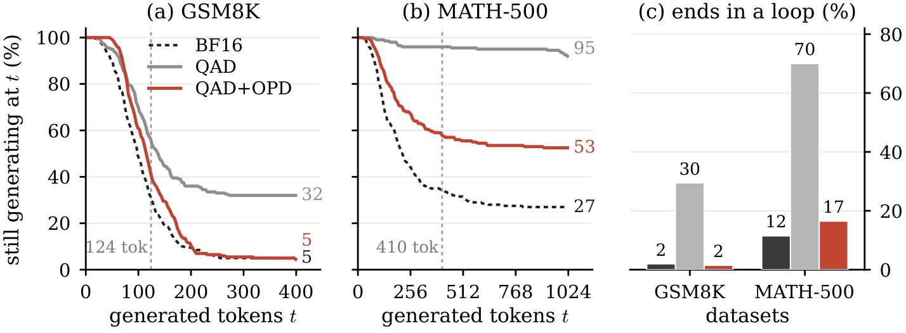
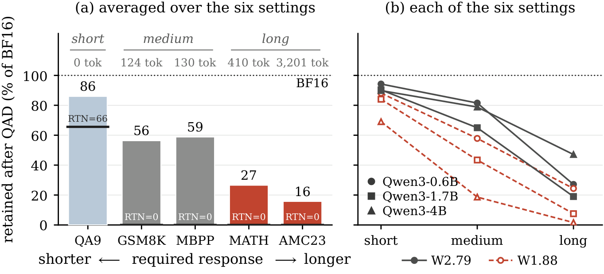

# Stages 2 and 3 — on-policy distillation

Both stages sample completions through the **deployment quantized forward
path** while the optimizer updates BF16 master weights. A frozen BF16 teacher
supplies token-level targets on those sampled prefixes, and a task verifier
scores whole trajectories. The teacher is each student's own BF16 copy, except
Qwen3-0.6B, whose BF16 copy is too weak to supervise; it uses Qwen3-1.7B.

<div align="center">

</div>

## Why on-policy

Quantization damage is not uniform across the two things a model does.

<div align="center">

</div>

Likelihood-scored QA barely moves, because scoring a fixed set of options
needs one forward pass and never compounds. Generative benchmarks collapse,
because an error at one token conditions every token after it. QAD trains on
reference prefixes, so the student is never supervised at the states its own
errors lead to — which is exactly the regime that breaks. OPD puts the
supervision there.

The KV cache stays at 16 bits during OPD. Some configuration and mode names
carry a legacy `kv8` tag from the QAD stage — the effective setting is the
`kv_cache_function` field in `configs/opd/`, which the OPD configs omit.

## Phase 1 — mathematics

```bash
BITWIDTH=w2.79 \
STUDENT_MODEL=<QAD checkpoint> \
STEPS=80 \
bash scripts/opd/run_math.sh
```

Corpus `unified_math_v1`. Learning rate 3e-6 with no warmup, 8 prompts per
optimizer step, G=4 completions per prompt, prompts truncated at 1664 tokens
and completions at 1536.

The rest is per model size, and `run_math.sh` reads the student's `hidden_size`
to pick it, so a plain invocation reproduces the published arm:

| Student | Steps | Student+teacher GPUs | Tokens per GPU | Rollout memory |
| --- | --- | --- | --- | --- |
| Qwen3-0.6B | 80 | 2+2 | 16384 | 0.25 |
| Qwen3-1.7B | 80 | 2+2 | 16384 | 0.25 |
| Qwen3-4B | 120 | 4+4 | 4096 | 0.15 |

The last three columns look like throughput settings and are not. The GPU split
decides each rank's share of the batch, so doubling the student halves
`global_seqlen/mean` and the update runs against a different micro-batch
structure; and the 4B student only just fits, so a larger token budget or a
greedier rollout engine goes out of memory in the opening steps, when a damaged
student still runs most of its completions to the length cap. The 4B arms also
need `optimizer_offload=True`, which the script adds on its own.

Checkpoint every 10 steps and select on validation — the optimum is frequently
early, well inside the budget.

## Phase 2 — code

```bash
BITWIDTH=w2.79 \
STUDENT_MODEL=<the phase-1 checkpoint you picked> \
bash scripts/opd/run_code.sh
```

With no `STUDENT_MODEL` set this falls back to the highest-numbered checkpoint
of the newest run, which is a convenience, not a selection — pass the
checkpoint you picked.

Two code pools ship, and `CODE_VARIANT` chooses between them:

| `CODE_VARIANT` | pool |
| --- | --- |
| `mbpp_official_k1_t17_strict_lr3e6_s30` (default) | the MBPP official *train* split |
| `kodcode_k1_t17_strict_lr3e6_s30` | KodCode, the wider pool — build it first, see [`data/README.md`](../data/README.md) |

Either way the 448 MBPP test rows stay out of training and are used for
evaluation only. Learning rate 3e-6, 4 prompts per optimizer step, G=4, 140
steps saving every 20. The optimum on this phase is often early, around step
20 to 40, so scan rather than taking the endpoint.

## Bit widths

`scripts/lib/bitwidth.sh` maps a single `BITWIDTH` to both knobs that must
agree — the quantizer config and the EdgeRazor quant mode — and fails loudly if
they disagree. Setting only one of them trains a different model with no error
anywhere, which is why they are derived from one variable.
