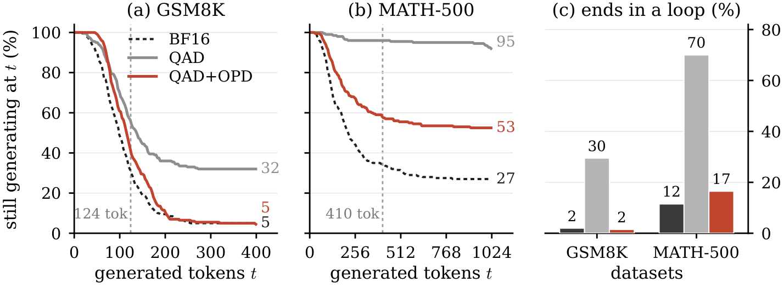
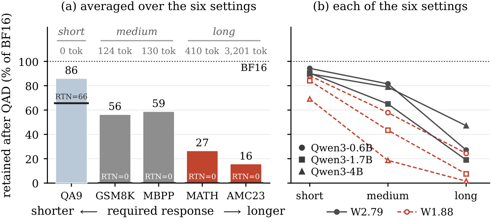

# Stages 2 and 3 — on-policy distillation

Both stages sample completions through the **deployment quantized forward
path** while the optimizer updates BF16 master weights. A frozen BF16 teacher
supplies token-level targets on those sampled prefixes, and a task verifier
scores whole trajectories. The teacher is each student's own BF16 copy, except
Qwen3-0.6B, whose BF16 copy is too weak to supervise; it uses Qwen3-1.7B.

<div align="center">

</div>

## Why on-policy

Quantization damage is not uniform across the two things a model does.

<div align="center">

</div>

Likelihood-scored QA barely moves, because scoring a fixed set of options
needs one forward pass and never compounds. Generative benchmarks collapse,
because an error at one token conditions every token after it. QAD trains on
reference prefixes, so the student is never supervised at the states its own
errors lead to — which is exactly the regime that breaks. OPD puts the
supervision there.

The KV cache stays at 16 bits during OPD. Some configuration and mode names
carry a legacy `kv8` tag from the QAD stage — the effective setting is the
`kv_cache_function` field in `configs/opd/`, which the OPD configs omit.

## Phase 1 — mathematics

```bash
BITWIDTH=w2.79 \
STUDENT_MODEL=<QAD checkpoint> \
STEPS=80 \
bash scripts/opd/run_math.sh
```

Corpus `unified_math_v1`. Learning rate 3e-6 with no warmup, 8 prompts per
optimizer step, G=4 completions per prompt, prompts truncated at 1664 tokens
and completions at 1536.

The rest is per model size, and `run_math.sh` reads the student's `hidden_size`
to pick it, so a plain invocation reproduces the published arm:

| Student | Steps | Student+teacher GPUs | Tokens per GPU | Rollout memory |
| --- | --- | --- | --- | --- |
| Qwen3-0.6B | 80 | 2+2 | 16384 | 0.25 |
| Qwen3-1.7B | 80 | 2+2 | 16384 | 0.25 |
| Qwen3-4B | 120 | 4+4 | 4096 | 0.15 |

The last three columns look like throughput settings and are not. The GPU split
decides each rank's share of the batch, so doubling the student halves
`global_seqlen/mean` and the update runs against a different micro-batch
structure; and the 4B student only just fits, so a larger token budget or a
greedier rollout engine goes out of memory in the opening steps, when a damaged
student still runs most of its completions to the length cap. The 4B arms also
need `optimizer_offload=True`, which the script adds on its own.

Checkpoint every 10 steps and select on validation — the optimum is frequently
early, well inside the budget.

## Phase 2 — code

```bash
BITWIDTH=w2.79 \
STUDENT_MODEL=<the phase-1 checkpoint you picked> \
EXPERIMENT_NAME=p2_w279 \
bash scripts/opd/run_code.sh
```

The student samples G=4 completions per prompt from a pool of Python problems,
each a function stub with a docstring. The BF16 teacher scores the sampled
tokens, and its top-64 log-probabilities give a forward-KL target applied as a
direct gradient on every token; a GRPO term adds the verifier's verdict, 1 when
the completion passes every test of its problem and 0 otherwise. One optimizer
update per step, `clip_ratio_high=0.28`, a constant learning rate, prompts
truncated at 1024 tokens and completions at 512, a checkpoint every 50 steps.

The pools come from OpenCoder's educational_instruct subset, KodCode-V1 and the
MBPP official *train* split, and `data/build_code_pools.py` builds them — see
[`data/README.md`](../data/README.md). The 448 MBPP test rows and HumanEval are
used for evaluation only.

The rest is per arm, and `run_code.sh` resolves it from the student's
`hidden_size` and `BITWIDTH`:

| Student | Width | Stages: pool, steps, learning rate | Prompts per step | Student+teacher GPUs | Teacher |
| --- | --- | --- | --- | --- | --- |
| Qwen3-0.6B | W2.79 | `code_opd_12k`, 300, 3e-6 | 32 | 1+1 | Qwen3-1.7B |
| Qwen3-0.6B | W1.88 | `code_opd_24k`, 600, 3e-6 | 32 | 2+1 | Qwen3-1.7B |
| Qwen3-1.7B | both | `code_opd_16k`, 300, 3e-6 → `code_opd_18k`, 300, 1e-6 | 32 | 4+1 | Qwen3-1.7B |
| Qwen3-4B | W2.79 | `code_opd_24k`, 300, 3e-6 | 32 | 4+1 | Qwen3-4B |
| Qwen3-4B | W1.88 | `code_opd_24k`, 300, 3e-6 | 64 | 4+1 | Qwen3-4B |

The Qwen3-1.7B arm runs two stages: the second starts from the last checkpoint
of the first and trains, at a third of the learning rate, on problems the first
never saw. It writes to `runs/$EXPERIMENT_NAME`, and the first stage to
`runs/${EXPERIMENT_NAME}_stage1`. The 4B arms offload the optimizer state, which
the script adds on its own, and each arm fixes its seed (`SEED`; the data order
follows from it).

Report the last checkpoint of the last stage. The intermediate ones are for the
validation curve on MBPP's 82-row validation split, not for picking a point on a
test set.

As in phase 1, everything takes an override — `STEPS` sets the length of every
stage (useful for a short trial), `CODE_STAGES=pool:steps:lr,...` replaces the
stage list, and `SEED`, `STUDENT_NGPUS` and `TRAIN_BATCH_SIZE` do what they say.
The script prints the resolved recipe and names anything that differs from it;
`STRICT_RECIPE=1` makes that an error.

## Bit widths

`scripts/lib/bitwidth.sh` maps a single `BITWIDTH` to both knobs that must
agree — the quantizer config and the EdgeRazor quant mode — and fails loudly if
they disagree. Setting only one of them trains a different model with no error
anywhere, which is why they are derived from one variable.
